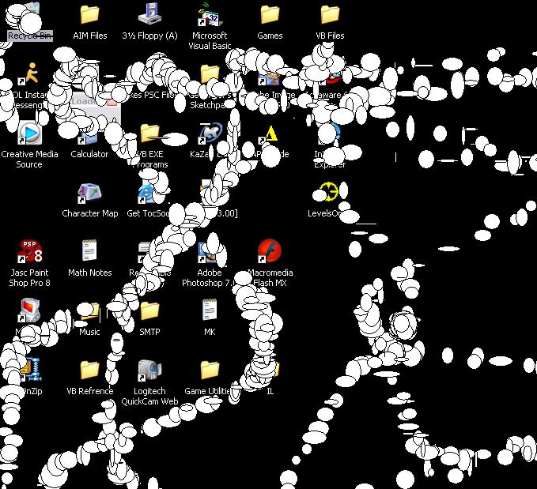

<div align="center">

## Elipse Loader, a fun prank


</div>

### Description

this loads elipses with widths and hights from 0 to 20 where ever your mouse moves, the only funny thing about this is it loads the elipses on anything, because it uses GetCursorPos, Ellipse, and GetWindowDC API.

very simple and easy to understand.

enjoi!

-LCSBSSRHXXX
 
### More Info
 


<span>             |<span>
---                |---
**Submitted On**   |2004-05-25 16:52:56
**By**             |[LCSBSSRHXXX](https://github.com/Planet-Source-Code/PSCIndex/blob/master/ByAuthor/lcsbssrhxxx.md)
**Level**          |Intermediate
**User Rating**    |4.3 (13 globes from 3 users)
**Compatibility**  |VB 6\.0
**Category**       |[Jokes/ Humor](https://github.com/Planet-Source-Code/PSCIndex/blob/master/ByCategory/jokes-humor__1-40.md)
**World**          |[Visual Basic](https://github.com/Planet-Source-Code/PSCIndex/blob/master/ByWorld/visual-basic.md)
**Archive File**   |[Elipse\_Loa1750245252004\.zip](https://github.com/Planet-Source-Code/lcsbssrhxxx-elipse-loader-a-fun-prank__1-54018/archive/master.zip)

### API Declarations

```
Private Declare Function GetWindowDC Lib "user32" (ByVal hwnd As Long) As Long
Private Declare Function Ellipse Lib "gdi32" (ByVal hdc As Long, ByVal X1 As Long, ByVal Y1 As Long, ByVal X2 As Long, ByVal Y2 As Long) As Long
Private Declare Function GetCursorPos Lib "user32" (lpPoint As POINTAPI) As Long
```


